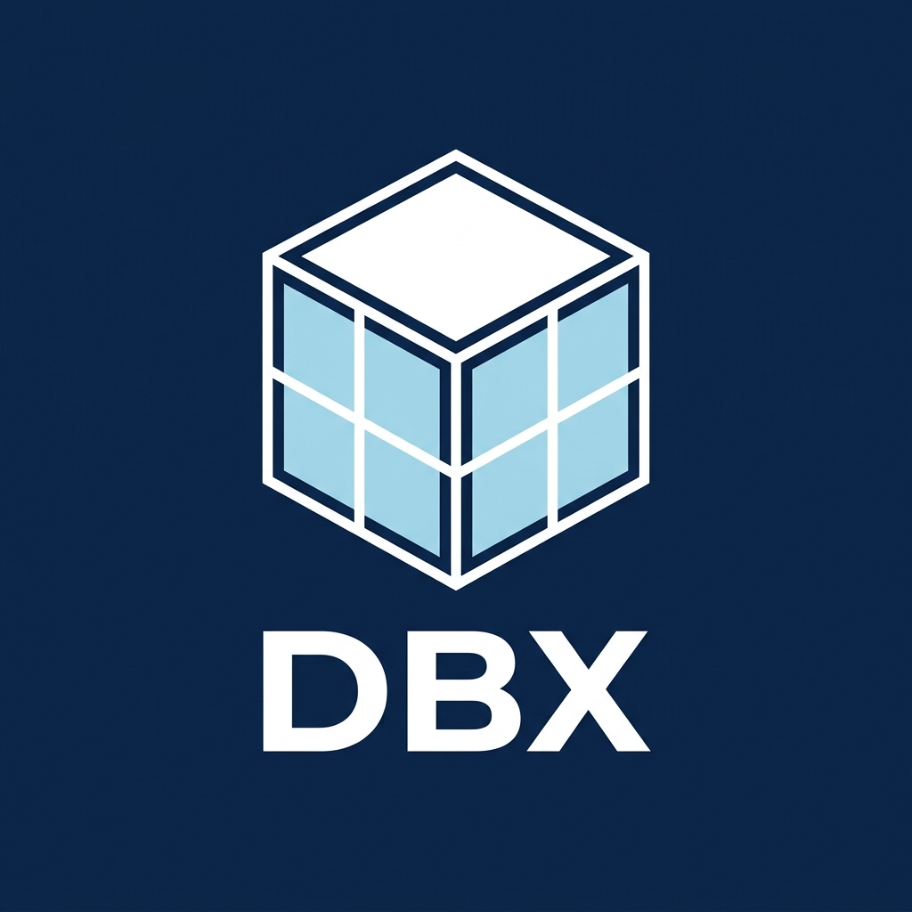

<p align="center">
  
</p>

<h1 align="center">DBX</h1>

<p align="center">
  <strong>The per-tenant memory engine for AI products.</strong>
  <br />
  One isolated store per customer, holding their working state <em>and</em> their vector memory.
</p>

<p align="center">
  <a href="https://github.com/vanshjain-0702/DBX-Database-Extreme/actions/workflows/build-and-test.yml"></a>
  <a href="LICENSE"></a>
  <a href="https://github.com/vanshjain-0702/DBX-Database-Extreme/releases"></a>
  
</p>

---

## Release status

**DBX v1 is cleared for single-node production** under the supported preview
profile: 100 tenants/node, 100k vectors/tenant, durable strings + vectors.
Linux CI enforces race detection, coverage floors, noisy-neighbor isolation, and
the 100k-vector harness. Optional async WAL replicas can be provisioned without
putting writes through Raft; cluster/sharding, tiering, and non-string RESP
mutation families still fail closed. See the
[measured certification matrix](scripts/benchmarks/performance_analysis.md).

The WAL/checkpoint format is intentionally incompatible with pre-hardening data. For an
offline reset that preserves the old directory, run
`go run ./cmd/dbx-v1-reset -data-dir <tenant-dir> -confirm-reset`.

---

## The problem DBX exists to solve

You are building a product where **every one of your customers needs their own memory**: an
agent platform, a copilot, a vertical AI SaaS, an on-prem deployment per client.

The stores you can buy today are built around one large shared cluster. Tenancy is something
you bolt on yourself:

- You prefix every key with `tenant:{id}:` and pray no query forgets the prefix.
- You keep session state in one system and embeddings in another, then write to both and
  hope they don't drift.
- You cannot back up, export, delete, or move *one customer* — only the whole cluster.
- A noisy tenant's working set evicts a quiet tenant's cache.
- "Delete my data" from a customer becomes an engineering project instead of an API call.

**DBX makes the tenant the unit of the database.** One API call gives you an isolated engine
with its own data directory, its own write-ahead log, its own HNSW vector index, and its own
snapshot lineage. Isolation is structural, not a naming convention.

---

## What makes DBX different

### 1. A tenant is a first-class object
`POST /tenants` returns a live, isolated engine in milliseconds. Its keys, vectors, WAL, and
snapshots live in their own directory. Deleting a tenant deletes their data — no scan, no
prefix sweep, no cross-customer blast radius. Per-customer export and restore are file
operations, not migrations.

### 2. Working state and vector memory in one engine
An agent's session, its scratchpad, its rate counters (KV with TTL) and its semantic
recall (HNSW vectors) live in the same process, behind the same connection, in the same data
directory, and inside the same backup archive. There is no dual-write path between a cache and
a separate vector service to reconcile.

The periodic `.rdb` checkpoint covers KV; vectors are durable through checksummed metadata,
their mmap rows, and the WAL. A per-tenant backup takes a mutation maintenance lock and writes
a versioned manifest with SHA-256 checksums for both surfaces.

### 3. Quantized by default, so idle tenants are nearly free
Vectors are stored as 8-bit scalar-quantized rows in an mmap'd file with asymmetric distance
computation at query time. Payload is roughly a quarter the size of float32, and a tenant
nobody has queried today lives in page cache instead of resident RAM. Your cost scales with
*active* tenants, not with the count of tenants you've signed.

### 4. Self-hosted, single binary, with the operator UI included
Embeddings never leave your VPC. The admin dashboard, interactive console, data explorer, and
vector playground are compiled into the same binary you deploy. No sidecar, no separate
control-plane service to run.

### 5. Your existing clients already work
DBX speaks RESP, so `redis-py`, `ioredis`, and `go-redis` connect without a custom driver.
This is an adoption on-ramp — you don't have to learn a new protocol to try DBX — not a claim
that DBX is a substitute for a tuned Redis cluster.

---

## What DBX is deliberately not

We would rather be the obvious choice for one job than a mediocre option for five. DBX is
**not** competing on these axes, and you should use the right tool instead:

| If you need… | Use | Why not DBX |
|---|---|---|
| Maximum single-instance KV throughput for one huge shared workload | Redis / Dragonfly | Their whole design target; DBX spends cycles on per-tenant isolation |
| Billion-vector ANN with sharding, replicas, and payload filtering at scale | Qdrant / Milvus | DBX indexes are sized for per-tenant working sets, not one giant corpus |
| A fully managed vector service with no infrastructure | Pinecone | DBX is software you run; that is the point |
| Relational queries, joins, transactions across entities | Postgres (+ pgvector) | DBX is a memory engine, not a system of record |

DBX is the layer *between* those: fast, isolated, per-customer memory that sits in front of
your system of record.

---

## Who it is for

- **AI agent platforms** — each end-customer's agent gets its own memory namespace with real isolation.
- **Vertical AI SaaS** — per-client RAG corpora that must be separately backed up, exported, and deleted.
- **On-prem and regulated deployments** — the whole stack is one binary inside the customer's network.
- **Teams tired of running two systems** — a cache and a vector DB collapsed into one operational surface.

If you have one workload and one tenant, you probably don't need DBX. If you have five hundred
customers who each need memory, DBX is built for exactly that shape.

---

## Quickstart

### Option 1: Docker

```bash
docker run -p 8000:8000 -p 6380:6380 \
  -e DBX_ADMIN_PASSWORD='replace-with-12-plus-characters' \
  -e DBX_JWT_SECRET='replace-with-at-least-32-random-characters' \
  -e DBX_INTERNAL_API_TOKEN='replace-with-a-random-service-token' \
  -e DBX_NODE_MEMORY_BUDGET=8gb \
  ghcr.io/dbx/dbx:latest
```

Open the dashboard at **http://localhost:8000** and log in with `admin` / `yourpassword`.

### Option 2: Build from source

**Prerequisites:** Go 1.25+, Node.js 20+

```bash
git clone https://github.com/dbx/dbx.git
cd dbx

make build      # build all binaries
make run-dev    # start the local development stack
```

### Option 3: Docker Compose

```bash
git clone https://github.com/dbx/dbx.git
cd dbx
make docker-up
```

---

## The tenant lifecycle

This is the API that defines the product. Everything else is a data-plane detail.

```bash
# Provision an isolated engine for a customer
curl -X POST http://localhost:8000/api/provision \
  -H "Authorization: Bearer $DBX_TOKEN" \
  -d '{"id": "acme-corp", "name": "Acme Corp"}'

# Talk to that tenant, and only that tenant
curl -X POST http://localhost:8000/t/acme-corp/query \
  -H "Authorization: Bearer $DBX_TOKEN" \
  -d '{"command": "SET session:42 active"}'

# Back up one customer, not the whole cluster
curl -X POST http://localhost:8000/api/tenants/backup \
  -H "Authorization: Bearer $DBX_TOKEN" \
  -d '{"id": "acme-corp"}'

# Restore that checksummed archive into the same tenant
curl -X POST http://localhost:8000/api/tenants/restore \
  -H "Authorization: Bearer $DBX_TOKEN" \
  -d '{"id": "acme-corp", "path": "data/backups/backup_acme-corp_....dbx.zip"}'

# Off-boarding is one call, not a data-deletion project.
# purge=true erases that tenant's directory and nothing else.
curl -X POST http://localhost:8000/api/tenants/delete \
  -H "Authorization: Bearer $DBX_TOKEN" \
  -d '{"id": "acme-corp", "purge": true}'
```

---

## Connect your application

### Python (AI / LangChain)

```python
from dbx import DBXClient

db = DBXClient(
    host="localhost",
    port=6380,
    tenant="acme-corp",
    key_id="key-id",
    secret="one-time-key-secret",
)

# Working state for this customer's agent
db.set("session:42", '{"thread": "onboarding", "step": 3}')

# Semantic memory for the same customer, same engine, same backup
db.vadd("memories", "doc:1", [0.1, 0.2, 0.9])
results = db.vsearch("memories", [0.1, 0.2, 0.8], top_k=5)
```

The full path — login, provision, mint a key, AUTH, SET, VADD, usage, export, purge — is
[`examples/quickstart.py`](examples/quickstart.py). Control-plane helpers live on
`ControlPlane`. Per-tenant cost is `GET /api/v1/tenants/{id}/usage`. Prometheus is
`GET /metrics` on the orchestrator.

### Node.js / TypeScript

```typescript
import { createClient } from 'redis'; // DBX speaks RESP, so existing clients work

const client = createClient({ url: 'redis://localhost:6380' });
await client.connect();
await client.sendCommand(['AUTH', 'acme-corp:key-id', 'one-time-key-secret']);
await client.set('session:abc', JSON.stringify({ userId: 42 }));
```

---

## Architecture

```
┌─────────────────────────────────────────────────────────────────┐
│  HTTP control plane :8000     Authenticated RESP ingress :6380  │
│      tenant lifecycle, scoped credentials, routing, backups     │
│─────────────────────────────────────────────────────────────────│
│  Tenant A               │  Tenant B               │  Tenant N…  │
│  ┌──────────────────┐   │  ┌──────────────────┐   │             │
│  │  KV Engine       │   │  │  KV Engine       │   │             │
│  │  HNSW Vectors    │   │  │  HNSW Vectors    │   │             │
│  │  (SQ8, mmap)     │   │  │  (SQ8, mmap)     │   │             │
│  │  Own WAL         │   │  │  Own WAL         │   │             │
│  │  Own snapshots   │   │  │  Own snapshots   │   │             │
│  └──────────────────┘   │  └──────────────────┘   │             │
└─────────────────────────────────────────────────────────────────┘
```

Each tenant is an isolated engine with its own durability chain. The orchestrator owns
provisioning, authentication, and routing.

For the deep dive, read the [Architecture Document](docs/architecture.md). For the product
thesis and where we will and will not compete, read [Positioning](docs/positioning.md).

---

## Project structure

```
dbx/
├── cmd/
│   ├── dbx-server/         # Storage node entry point
│   └── dbx-orchestrator/   # Control plane entry point
├── internal/
│   ├── engine/             # KV engine + HNSW vector index (SQ8, mmap)
│   ├── orchestrator/       # Tenant lifecycle, provisioning, routing
│   ├── protocol/           # RESP3 parser and writer
│   ├── persistence/        # WAL, snapshots, S3 backup
│   ├── security/           # ACL, rate limiting, encryption
│   └── api/                # HTTP API handlers
├── dashboard/              # React + Vite admin dashboard (embedded)
├── sdk/python/             # Official Python SDK
├── examples/               # LangChain RAG, Next.js caching
├── deploy/                 # Docker Compose and Helm charts
└── docs/                   # Architecture, API reference, positioning, roadmap
```

---

## Performance

Numbers from a local single-node run. They exist to show that per-tenant isolation does not
cost you an order of magnitude — not to rank DBX against a tuned cluster of something else.
Measure on your own hardware before you rely on any of this.

| Operation | Single node, local | Measured with |
|---|---|---|
| SET (string) | 186,147 ops/sec | RESP, 64 connections, pipeline 64, WAL `everysec` |
| GET (string) | 284,785 ops/sec | Same run, 128k operations |
| Vector ingest | 7,233 vectors/sec | 100k × 128-dim, batches of 1,000, 8-way sharded HNSW |
| ANN search | p50 2.304 / p95 3.132 / p99 3.730 ms | 100k vectors, 128-dim, efSearch=80, 50 queries |
| Recall@10 | mean 0.920 / p05 0.800 | SQ8 HNSW vs float32 brute force |
| Vector payload | ~4× smaller than float32 | SQ8 quantization |

Methodology and the honest caveats are in
[scripts/benchmarks/performance_analysis.md](scripts/benchmarks/performance_analysis.md).

---

## Roadmap

CI runs a scaled density soak (12 idle / 4 active) plus backup/restore and hibernate
tests. Operators run the certified 100/25 profile with `make soak`. Per-tenant usage
is `GET /api/v1/tenants/{id}/usage`. The 15-minute path is `examples/quickstart.py`.
See [ROADMAP.md](ROADMAP.md).

CI runs a scaled density soak (12 idle / 4 active) plus backup/restore and
hibernate tests. Operators run the certified profile with `make soak`.
Per-tenant usage is `GET /api/v1/tenants/{id}/usage`. The 15-minute path is
`examples/quickstart.py`.

---

## License

DBX is licensed under the [Business Source License 1.1 (BSL 1.1)](LICENSE).

- ✅ **Free to use** for production, personal, and commercial applications.
- ✅ **Free to self-host** for any purpose, including inside your own SaaS.
- ❌ **Cannot** be offered as a managed DBX service to third parties without a commercial agreement.

The license converts to Apache 2.0 after 4 years. If you want to run DBX as a managed
service, talk to us at `hello@dbxdb.io`.

---

## Contributing

We welcome contributions. Please read [CONTRIBUTING.md](CONTRIBUTING.md) and open an issue or
pull request.

---

<p align="center">Built with ❤️ by the DBX team.</p>
