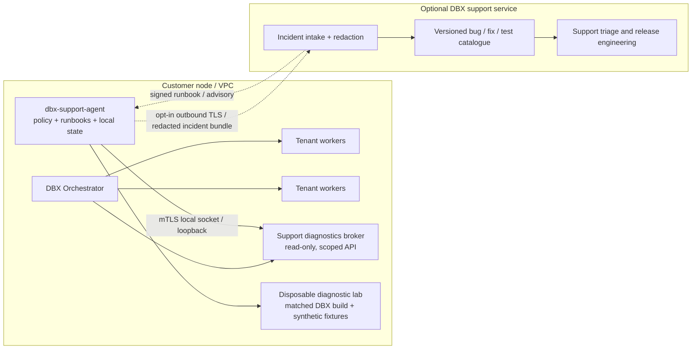
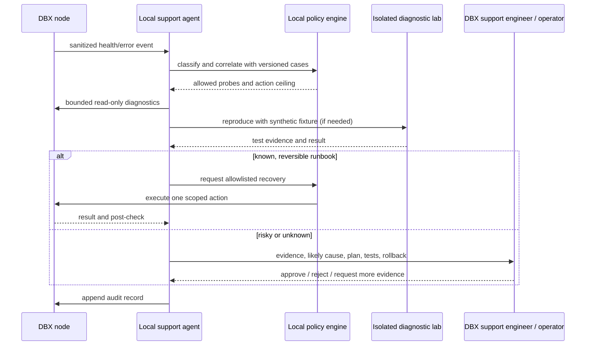

# DBX Support Operations Agent: Product and Architecture Plan

## Executive recommendation

Build a local-first **DBX Support Operations Agent**: an opt-in service installed
beside each DBX deployment. It watches DBX health, identifies known failure
patterns, runs version-matched diagnostics, and performs a small, audited set of
safe recovery actions. It creates a reproducible incident package for everything
it cannot resolve.

Treat this as an operations and reliability system with AI assistance, rather
than an AI with unrestricted access to a database. Start with deterministic
health checks and runbooks. Add model-assisted diagnosis only after the diagnostic
signals and the historical bug/fix catalogue are trustworthy. Never let a model
write arbitrary files or execute arbitrary commands on a customer node.

The realistic product promise is: **routine, already-understood DBX incidents
are resolved automatically; unknown bugs are isolated, reproduced, and handed
back with the evidence and proposed fix needed for a fast release.** No honest
system can promise to automatically fix every new software defect without risk.

## Customer outcome and operating contract

The operator opts in to a support policy at install time and chooses one of
three modes:

| Mode | What the agent does | Data leaves the customer node? |
|---|---|---|
| Local only | Collects diagnostics, evaluates rules, executes permitted local runbooks, stores incident history locally | No |
| Connected support | Same local behavior; sends redacted incidents and health summaries to DBX support | Only the fields the operator enabled |
| Approval required | Diagnoses and proposes actions; an operator approves every mutation | Only the fields the operator enabled |

The default should be **local only, read-only**. Connected support and any
automatic remediation are explicit opt-ins. The service must continue to protect
the DBX workload if it stops, crashes, loses network access, or uses too much
memory. DBX data-plane writes must never depend on the support service.

The agent is not an application support service for a customer's legal or
healthcare product. It diagnoses the DBX engine and the DBX deployment boundary;
it does not decide whether a legal result or clinical answer is correct.

## Fit with the current DBX architecture

DBX already has useful control-plane operations to build on:

- Authenticated operator API and a single public RESP ingress.
- Tenant health and lifecycle state, usage (`keys`, `vectors`, memory, disk,
  command/error counters), Prometheus `/metrics`, backup/restore, and
  hibernate/wake.
- Tenant-scoped reader, writer, and tenant-admin keys.
- A useful regression base: Go package tests, Linux race/isolation checks,
  backup/restore and lifecycle tests, vector recall/performance harnesses, and
  the 100-idle/25-active density soak.
- The synthetic firm-scale harness at
  [`scripts/benchmarks/two_firm_stress.py`](../scripts/benchmarks/two_firm_stress.py)
  provides one repeatable multi-tenant workload, but its Windows inprocess run
  does not certify production strict isolation.

The current interfaces are not yet a complete support-agent contract. The
metrics expose useful totals but need stable error categories, command-family
latency histograms, WAL/checkpoint/replica state, restart history, and disk
pressure signals. DBX now has an initial support capability API configured by
separate read/wake secrets and explicit tenant allowlists. It does not yet have
per-agent identity management, short-lived tokens, online revocation, or a
support-specific admin UI. The extension must not borrow a tenant-admin key or
operator JWT.

The manually started preview lives in [`support-extension/`](../support-extension/).
It has local diagnostic rules, synthetic scenarios, a local log code counter,
and a redacted bundle writer. The DBX orchestrator now exposes separate static
read and wake capabilities, each restricted to configured tenant IDs. The read
route returns only allowlisted tenant and usage summaries; the wake route can
only wake tenants in a second allowlist, writes a server-side audit record
before acting, and applies a per-tenant cooldown. The extension retains neither
capability after exit. This is a safer boundary than the previous operator JWT
path, but the capabilities are static shared secrets rather than short-lived
workload identities. No worker restart, restore, data repair, configuration
change, or code deployment is available. The scoped API is an initial security
foundation, not evidence that the service meets production support SLOs.

There is also documentation drift to capture in the knowledge process: the
roadmap's older restore entry describes missing restore behavior, while current
code and tests include `RestoreTenant` and round-trip tests. The agent must use
versioned source and test evidence, not an unversioned text search result, as its
source of truth.

## Target architecture

### Components

1. **Diagnostics broker in the orchestrator.** A narrow internal API returns
   health snapshots, metric deltas, versions, lifecycle events, and sanitized
   error events. It has no endpoint for reading arbitrary KV values or vectors.
   It limits requests, validates tenant scope, and emits an audit event for each
   support action. The support agent authenticates with a distinct short-lived
   workload identity.
2. **Local `dbx-support-agent` service.** Runs as a separate OS account where
   available, outside tenant worker sandboxes. It polls or subscribes to the
   broker, evaluates deterministic rules, attaches a matching runbook, and
   maintains an incident state machine. Its local state is encrypted and
   stored outside tenant directories and outside the DBX database it monitors.
3. **Policy engine.** Maps every proposed action to a risk class, required
   permission, precondition, timeout, rate limit, rollback, and approval rule.
   Unknown actions are denied. Policy is locally enforceable even if an optional
   cloud support service is unavailable.
4. **Versioned diagnostics and runbook pack.** Signed, release-matched rules,
   probes, and instructions. The pack records the DBX versions and platforms on
   which each action was tested, plus its expiry and minimum agent version.
5. **Disposable diagnostic lab.** Recreates a failure using a pinned DBX build,
   synthetic data, and a recorded environment. It runs tests and stress probes
   away from customer data. The lab has no customer credentials and no route
   back into the production node.
6. **Optional vendor support service.** Receives only operator-approved,
   redacted incident bundles. It stores cases and test/fix relationships,
   routes high-severity incidents to a human DBX engineer, and publishes signed
   advisories/runbook updates. It cannot directly open a customer connection.
7. **Operator dashboard and CLI.** Shows why an alert fired, evidence, confidence,
   proposed or completed action, rollback status, and the exact tests used.
   Provide `dbx support status`, `dbx support doctor`, `dbx support collect`,
   `dbx support approve <incident>`, and `dbx support disable`.

## Trust and safety model

### Capabilities and credentials

Create a support-specific capability set, separate from tenant application roles:

- `diagnostics.read`: health, counters, lifecycle, version, sanitized logs.
- `diagnostics.probe`: bounded, non-mutating self-checks.
- `tenant.restart`: restart one unhealthy tenant after policy checks.
- `tenant.hibernate_wake`: lifecycle action, only when the operator enabled it.
- `backup.create`: create a backup; never purge or overwrite one.
- `restore.propose`: validate a restore plan. Actual restore requires explicit
  operator approval and a verified recovery point.
- `config.propose`: produce a reviewed configuration diff, never apply it in
  autonomous mode.

Use short-lived, revocable identities scoped to the node and action. Bind local
agent-to-broker communication to a Unix socket with OS peer checks on Linux, or
mutual TLS on platforms without the required Unix-socket guarantees. Record the
agent identity, incident, policy version, request, result, and approval in an
append-only audit trail. Do not issue the agent a tenant-admin secret, the
operator's reusable JWT, the KEK, or access to raw tenant files.

### Autonomy levels

| Level | Allowed behavior | Examples |
|---|---|---|
| 0 — Observe | Read telemetry and report | Worker health, latency trend, disk warning |
| 1 — Diagnose | Run bounded read-only probes and suggest likely causes | Check WAL readability, compare tenant and node counters |
| 2 — Safe recovery | Execute allowlisted, reversible actions with rate limits | One restart of a worker that failed its health check; wake a tenant explicitly marked hibernated |
| 3 — Approved recovery | Wait for operator approval before a risky operation | Restore a backup, promote a replica, change limits, alter configuration |
| 4 — Code repair | Prepare a patch and prove it in CI/lab; human review and release required | Bug fix, migration, dependency upgrade |

There is **no autonomous production code patching**. Never automatically purge
data, disable authentication/TLS/isolation, change keys, run arbitrary shell
commands, rewrite a tenant directory, or restore over live data. A restart is
also bounded: at most one automatic attempt per incident, then stop and escalate
to avoid restart loops and data loss.

### Data minimization

Default diagnostic bundles contain DBX version/build ID, OS/kernel, isolation
profile, sanitized configuration (no secret values), error codes, timestamps,
resource counters, anonymized tenant IDs, and probe results. Exclude values,
document text, vector floats, embeddings, key names where they can identify a
person, credentials, WAL contents, and backup archives. If a support engineer
needs payload-level evidence, require a separate customer action to export a
specific synthetic or redacted sample, with scope and retention shown before
upload.

Customer-side encryption keys and support-service encryption keys must be
separate. Define retention and deletion controls for every incident artifact.
Offer a fully offline update path with signed diagnostic packs for restricted
environments.

## The learning system: tests and fixes as executable knowledge

“Train the team” should initially mean **curated evidence, retrieval, and
regression tests**, not fine-tuning a model on production data. Every known issue
becomes a reviewed, versioned case in a DBX Bug and Fix Catalogue.

### Case record schema

Each case should contain:

- Stable case ID, component, affected/fixed versions, OS and isolation profiles.
- User-visible symptom and machine-detectable signature.
- Preconditions, reproduction steps, and a safe synthetic fixture.
- Root cause with links to source files, issue/PR, and the fixing commit.
- The regression test that fails before the fix and passes after it.
- The complete required validation set (unit, race, integration, soak,
  benchmark, strict isolation, upgrade/restore as appropriate).
- Approved mitigations, their risk class, preconditions, stop conditions, and
  rollback instructions.
- Known false positives, unresolved variants, owner, reviewer, and review date.

No case becomes an automatic remediation until a DBX engineer and a reliability
reviewer sign it, its reproducer is deterministic, and the matching runbook has
passed against every supported DBX version listed in the case. When a fix changes
or a test is renamed, CI marks dependent cases stale instead of silently
continuing to recommend them.

### Knowledge ingestion and feedback loop

1. Import test results, incident reports, reviewed fixes, release notes, and
   source references. Do not ingest arbitrary production database contents.
2. Normalize each bug into a case record. Preserve exact version, platform,
   configuration, and test command; do not treat two similar error strings as
   the same root cause automatically.
3. Have a DBX owner approve the root cause, known-good fix, and recovery policy.
4. Run the repro and regression test in CI, then test the signed runbook in a
   disposable lab.
5. Release a signed catalogue entry tied to supported DBX versions.
6. When an incident occurs, retrieve matching cases with evidence and show
   the evidence-to-case links. The model can summarize; deterministic rules
   decide whether an action is allowed.
7. Capture operator acceptance/rejection and outcome. An engineer reviews
   outcomes before updating a case or changing an automation policy.

Start with retrieval-augmented diagnosis and a small classifier over sanitized
error/metric signatures. Fine-tuning is a later option only if the reviewed case
corpus is large enough, licensing/privacy constraints are clear, and a held-out
evaluation proves a measurable improvement. Keep deterministic policy outside
the model in every version.

### DBX test curriculum

Build the catalogue around the actual DBX test and operations surface:

- **Storage and protocol:** RESP parsing, ACLs, durable string/TTL operations,
  WAL framing/recovery, snapshots, crash recovery, vector reopen and graph
  rebuild.
- **Vector behavior:** batch ingest, HNSW recall, search flags and filters,
  VSIM/VFUSE, named spaces, tombstones/compaction, time travel, and migration
  start/add/swap/cancel.
- **Tenant isolation:** scoped-key auth and revocation, key-pattern boundaries,
  cross-tenant denial, quota rejection, noisy-neighbor behavior, panic handling,
  and Linux strict-mode filesystem/network/crypto checks.
- **Lifecycle and durability:** provision, backup/restore, hibernate/wake,
  restart, replica lag/promote where enabled, and upgrade/rollback.
- **Performance:** the 100k-vector recall/latency gate, benchmark harness,
  100-idle/25-active soak, and the synthetic two-firm workload.
- **Operational/API:** metrics authorization, usage consistency, admission,
  backup validation and audit coverage.

For each release, the agent should know which tests are mandatory for each
incident class. Example: a vector-search regression requires vector unit tests,
recall validation, restart/reopen coverage, and a tenant-level integration
reproduction; a restore incident requires checksum rejection, round trip,
rollback-on-failed-restore, and strict-worker restore tests.

## Incident workflow

1. **Detect:** correlate alerts over a time window; apply hysteresis and
   deduplication so one incident does not create thousands of tickets.
2. **Classify:** identify DBX build, OS, isolation mode, tenant state, and
   whether the symptom matches a reviewed case. Unknown or conflicting signals
   go to diagnosis only.
3. **Collect:** create a bounded, redacted support bundle and a timeline. Never
   dump an entire tenant directory by default.
4. **Reproduce:** use a matched build and synthetic fixture in the diagnostic
   lab. If reproduction needs customer data, pause and request an explicit,
   scoped sample.
5. **Remediate:** run a signed allowlisted action only if all preconditions hold;
   verify health and data invariants immediately after it.
6. **Escalate:** send unknown bugs, repeated failures, and all high-impact events
   to human support with evidence, attempted checks, a minimized repro, and a
   test plan.
7. **Learn:** after the fix is reviewed and released, update the case and add a
   regression test. Do not let an unreviewed chat transcript become a runbook.

## Risk classes and example decisions

| Signal | Agent response | Autonomous? |
|---|---|---|
| Tenant is deliberately hibernated | Report status; offer wake | No surprise wake; operator policy may allow it |
| One tenant worker fails health checks | Collect logs and restart history; one restart if enabled; verify recovery | Yes, one bounded restart |
| Memory quota approaches limit | Alert with trend and tenant usage; suggest tuning/capacity | No config change |
| WAL/checkpoint checksum or recovery error | Stop repeated restarts; preserve evidence; recommend verified backup/recovery plan | No restore without approval |
| Replica is behind or primary unavailable | Measure lag and show failover impact | Promotion requires approval |
| Cross-tenant access attempt or isolation check fails | Freeze automation, preserve audit evidence, page security owner | No self-modifying security policy |
| Unknown panic or vector-search correctness failure | Reproduce in lab, run test curriculum, prepare patch proposal | No production code change |
| Disk pressure | Alert and identify safe candidates | Never delete data/backups automatically |

## Test and release gates for the support system

The support agent is security-sensitive production software and needs its own
release gates:

1. Unit/contract tests for event schemas, capabilities, redaction, policies, and
   runbook preconditions.
2. Replay tests over a labelled set of historical DBX incidents, including
   near-matches that must *not* trigger remediation.
3. Fault-injection tests for lost broker, stale credentials, duplicate events,
   agent restart, clock skew, full disk, damaged diagnostic bundle, and
   failed/partial remediation.
4. Integration tests against each supported DBX release and platform. Linux
   strict mode is mandatory before claiming production isolation support.
5. Adversarial tests: prompt injection in log strings, malicious tenant IDs,
   forged events, cross-tenant scope confusion, and requests to leak secrets.
6. Signed-pack verification, downgrade rejection, SBOM, dependency scanning,
   reproducible builds, and staged rollout of agent/catalogue versions.
7. Canary deployments first in DBX's own synthetic environments, then a small
   opt-in customer cohort. Automatic rollback on increased error rate,
   unexpected restarts, or any integrity-check failure.

Do not evaluate the agent only on whether it “fixed” an incident. Track both
correct intervention and correct abstention on unknown or unsafe cases.

## Proposed service objectives

Set targets after measuring a baseline, then publish them as operational SLOs:

- Agent overhead below 1% CPU on an idle node and a configurable memory ceiling.
- No increase to DBX write-path latency; support work yields under database
  pressure and is paused during overload.
- Every automated action has a complete audit trail and post-action check.
- Zero unauthorized cross-tenant diagnostic reads in red-team and CI tests.
- 100% of automatic remediations map to a signed, version-compatible runbook.
- For known incident classes, target at least 80% successful remediation without
  human intervention after beta data supports the claim.
- Zero automatic data purges, unapproved restores, security downgrades, or code
  deployments.
- Define alert precision, time to detect, time to useful diagnosis, false
  remediation rate, escalation time, and rollback success rate. Report these by
  version and incident severity, not as one overall “AI accuracy” number.

## Delivery plan

### Phase 0 — Operations contract and bug catalogue (2–3 weeks)

- Name DBX component owners and on-call escalation path.
- Inventory release-supported tests, known incidents, and previous fixes.
- Create the case schema, severity levels, data-handling policy, and initial
  risk matrix.
- Reconcile stale roadmap and operational documentation against code/tests.
- Pick 10–20 frequent, low-risk incident patterns for an initial evaluation set.

**Exit:** every initial case has a linked reproducer, fixed version, regression
test, and reviewed runbook or an explicit “diagnose only” disposition.

### Phase 1 — Instrumentation and `dbx support doctor` (3–5 weeks)

- Add stable error codes, component/version/build identity, latency histograms,
  restart counts, WAL/checkpoint status, replica lag, quota and disk thresholds.
- Add the diagnostics broker with a support-specific read-only capability.
- Add a local doctor command that runs bounded probes and produces a redacted
  bundle. Keep the support process separate from DBX data-plane code.

**Exit:** no secret or payload in the bundle; DBX remains available if the agent
is killed or disconnected.

### Phase 2 — Read-only local advisor (4–6 weeks)

- Ship signed case/runbook packs, local history, incident deduplication, and
  dashboard/CLI status.
- Add deterministic matching first; let an optional model summarize only the
  matched evidence and cite case/test IDs.
- Replay historical incidents and adversarial near-matches.

**Exit:** the advisor can diagnose without making any mutations and has an
acceptable false-positive/abstention rate on the labelled evaluation set.

### Phase 3 — Guarded operational recovery (4–8 weeks)

- Add the policy engine, short-lived credentials, audit records, rate limits,
  pre/post checks, and rollback/stop conditions.
- Start with one-restart recovery and explicitly enabled wake. Add backup
  creation as a non-destructive action.
- Keep restore, failover, purge, key rotation, and configuration changes behind
  explicit operator approval.

**Exit:** fault-injection tests prove the agent cannot exceed its policy and
cannot loop on repeated failures.

### Phase 4 — Patch preparation and opt-in support service (6–10 weeks)

- Connect redacted incident intake, human support queue, isolated reproduction
  jobs, and CI-backed patch proposals.
- Support outbound-only customer connections and offline catalogue updates.
- Add staged agent/catalogue rollout and automatic agent rollback.

**Exit:** a support engineer can move from incident to tested patch proposal with
traceable evidence, while no vendor service can directly execute on a customer
node.

### Phase 5 — Beta and expansion (ongoing)

- Pilot with internal synthetic nodes, then a small opt-in set of design
  partners across Linux strict and supported Windows/macOS profiles.
- Review every automatic action and every false positive weekly.
- Expand runbook automation only when the case-specific success and abstention
  gates pass.

## Initial ownership model

- **DBX reliability lead:** incident policy, SLOs, on-call process, and release
  gates.
- **DBX subsystem owners:** validate cases and fixes for protocol, persistence,
  vectors, orchestrator, and isolation.
- **Support automation engineer:** broker, agent, policy engine, and action
  auditability.
- **Test/reproduction engineer:** fixtures, fault injection, compatibility
  matrix, and regression evidence.
- **Security/privacy reviewer:** capability model, redaction, retention, threat
  model, and customer consent.
- **Human support engineer:** handles high-severity incidents and approves
  risky actions; feeds reviewed fixes back into the catalogue.

One person may cover multiple roles in an early team, but case approval, policy
approval, and release approval should not all be the same unchecked action.

## Decisions to settle before implementation

1. Is the initial product fully offline, or does the customer opt into DBX-hosted
   incident intake?
2. Which OS and DBX releases are supported for the first agent release?
3. Which actions may run automatically, and which always require a customer
   approval?
4. What incident fields may leave a customer node, for how long, and under what
   customer agreement?
5. Who owns 24/7 response for critical DBX incidents, and what response-time
   commitment can DBX actually meet?

These answers determine the first release boundary. The technical foundation
should remain local, scoped, auditable, and safe when every AI or network service
is unavailable.
